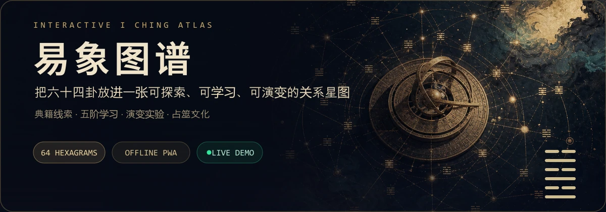
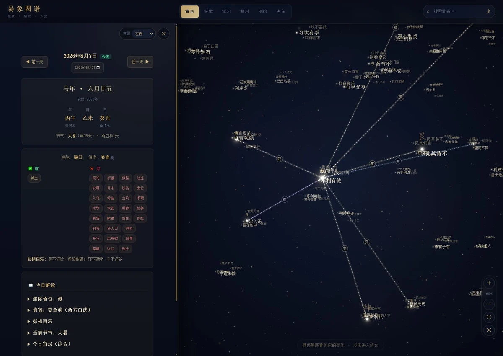
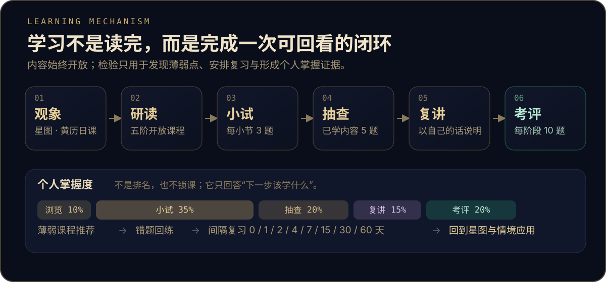

<p align="center">
  <a href="https://wyhcipuc.github.io/yijing-atlas/">
    
  </a>
</p>

<p align="center">
  <a href="https://wyhcipuc.github.io/yijing-atlas/"><strong>✦ 在线演示</strong></a>
  &nbsp;&nbsp;·&nbsp;&nbsp;
  <a href="https://github.com/WYHCIPUC/yijing-atlas/releases/latest"><strong>⬇ Windows 一键版</strong></a>
  &nbsp;&nbsp;·&nbsp;&nbsp;
  <a href="#一分钟开始"><strong>⌘ 本地运行</strong></a>
</p>

<p align="center">
  不是一本从头翻到尾的电子书，而是一座可以漫游、推演、复习和检验的《易经》学习空间。
</p>

---

## 75 秒认识易象图谱

<p align="center">
  <a href="https://github.com/WYHCIPUC/yijing-atlas/releases/latest/download/yijing-atlas-75s-full.mp4">
    
  </a>
</p>

<p align="center"><sub>自动循环预览 · 点击画面观看 75 秒完整宣传片</sub></p>

<p align="center">
  <a href="https://github.com/WYHCIPUC/yijing-atlas/releases/latest/download/yijing-atlas-75s-full.mp4"><strong>▶ 观看横屏主片</strong></a>
  &nbsp;&nbsp;·&nbsp;&nbsp;
  <a href="https://github.com/WYHCIPUC/yijing-atlas/releases/latest/download/yijing-atlas-30s.mp4"><strong>30 秒横屏预告</strong></a>
</p>

宣传片以真实页面为主体，重点呈现“观察关系—理解变化—主动回忆—间隔复习—阶段考评”的学习机制；占筮内容明确限定为传统文化学习与自我反思。

## 从一张星图开始

六十四卦不再是孤立的六十四页。易象图谱把错卦、综卦、互卦与变卦组织成可缩放的关系星图；选择一个卦，沿着连线就能看到它如何转化、为何关联，以及经传中有哪些依据。

<p align="center">
  <a href="https://wyhcipuc.github.io/yijing-atlas/">
    
  </a>
</p>

<p align="center"><sub>真实运行界面 · 黄历知识与卦象关系星图并置呈现</sub></p>

## 核心学习机制

易象图谱不以“看过多少页”作为学习完成，而是把观察、研读、回忆、表达、考校与温习串成闭环。课程始终开放，成绩不会锁住内容；系统只用学习记录发现薄弱点，并推荐下一次日课。

<p align="center">
  
</p>

学习路径参考“时习与温故”“学问思辨行”和古代阶段考校的思想，并用现代、非惩罚式的方式实现：

- **分层进学**：核心主干贯穿阴阳爻卦、本经、彖象、爻位、卦时与观变；另设义理注疏、象数传统、术数民俗三条旁支。
- **每课必有检验**：课后小试 3 题；随机抽查从已学内容跨课取 5 题；每阶段考评 10 题。
- **必须能说出来**：复讲要求用自己的话重组知识，可按典籍要点自评，也可接入安全的服务端智能评阅。
- **掌握度有来源**：浏览 10% + 小试 35% + 抽查 20% + 复讲 15% + 阶段考评 20%，形成“初闻—蒙学—习读—明辨—通达”个人学阶。
- **遗忘会被安排**：错题回到专项练习，卦象复习按 0 / 1 / 2 / 4 / 7 / 15 / 30 / 60 天逐步拉开间隔。

## 每个功能如何参与学习

### 01 · 黄历｜把抽象术语放回具体的一天

- **你会看到**：公历与农历、年/月/日干支、节气、建除十二神、二十八宿、彭祖百忌、宜忌和今日解读。
- **学习机制**：以“今天”为情境锚点，再切换前后日期比较同一术语如何变化；先形成观察，再进入「历法日用」课程理解定义与边界。
- **如何检验**：黄历术语会进入课后小试和综合测验，题目在“名称 → 含义”与“含义 → 名称”之间双向提取，避免只会眼熟。

### 02 · 星图探索｜先看关系，再记单卦

- **你会操作**：搜索卦名、缩放星图、聚焦某卦，并在错、综、互三种固定关系层之间切换；变卦必须先选具体动爻。
- **学习机制**：把六十四个孤立知识点转换为空间关系；通过相邻比较识别阴阳全换、上下倒转、内卦重组和单爻变化。
- **学习目标**：从“记住一个卦名”提升到“能说明它在关系网络中的位置”，为测验中的关系辨识建立心智地图。

### 03 · 演变实验室｜让“象变”与“义变”同时发生

- **你会操作**：逐爻切换，应用错、综、互预设，播放或单步推进，并使用撤销、重做、重置和速度控制。
- **学习机制**：动画每推进一帧，当前卦义、前后爻辞、小象、项目释义与典籍定位同步更新；视觉变化和语义变化在同一时刻对读。
- **认知边界**：中间帧用于理解结构，不冒充传统占筮断法；减少动态效果模式下直接切帧，但完整语义仍然保留。

### 04 · 卦序转盘｜用随机抽取打破顺序依赖

- **你会操作**：启动带机械声景的六十四卦转盘，随机停在一卦并展开完整详情。
- **学习机制**：随机提取打破“只会按顺序背诵”的熟悉感；在结果揭示前先回忆卦象、上下卦或核心卦义，再用详情立即核对。
- **适合用法**：作为每日暖身、课堂抽查或复讲题目，让每次进入项目都有不同的学习起点。

### 05 · 学习｜一条开放但可追踪的五阶学程

- **你会学习**：阴阳与爻位、八卦符号、六十四卦卦爻辞、十翼、五行河洛、错综互变和黄历基础。
- **学习机制**：系统先推荐尚未浏览的小节；全部浏览后，优先推荐小试成绩较低或久未温习的课程。所有内容始终可自由进入。
- **学习证据**：记录小节浏览、练习次数、最佳小试、最近学习时间、抽查、复讲和阶段考评，汇总为课程掌握度与连续学习天数。
- **复讲评阅**：默认使用本地典籍要点自评；如配置评阅服务，只发送课程、参考要点与本次复讲，浏览器和仓库不保存模型密钥。

### 06 · 复习｜在将要遗忘时再见一次

- **你会操作**：查看今日到期卦卡，回忆后选择“忘记 / 模糊 / 记得”，再核对卦象详情。
- **学习机制**：简化间隔重复算法根据反馈调整下次出现时间；“记得”逐级拉长间隔，“忘记”记录失误并回到短间隔。
- **学习目标**：把一次浏览转成长期记忆，同时用复习阶段而非总阅读量表示每一卦的熟练程度。

### 07 · 测验｜用主动回忆暴露真正的薄弱点

- **你会回答**：错卦、综卦、互卦、卦象与卦名，以及黄历术语辨识题；每题包含一个答案和三个干扰项。
- **学习机制**：答案必须从记忆中提取，错误选项迫使学习者辨认相近结构，而不是在原文旁边“照着找”。
- **反馈闭环**：正确率持续统计；答错的卦自动进入错题本，可直接指定目标卦回练，直到关系判断稳定。

### 08 · 占筮问道｜把知识迁移到结构化情境

- **你会体验**：三枚铜钱六次成卦，或以数字、当前时间进行简化梅花易数演示，并查看本卦、之卦、动爻和体用五行。
- **学习机制**：结果不是只给一句吉凶，而是依次解释取辞方法、专业术语、经传原文、通俗释义、现实类比与反思三问。
- **学习价值**：把卦辞、爻辞和变化规则放进一个完整案例中应用；历史记录便于回看推理过程，而不是追求不可检验的预言。
- **明确边界**：所有结果只用于传统文化学习与自我反思，不替代医疗、法律、财务、婚姻等现实专业判断。

### 09 · 辅助能力｜降低学习摩擦，而不是增加按钮

- **搜索与详情**：全文检索快速回到卦名、卦辞和知识条目；深链接可直接分享指定卦象。
- **分享卡片**：把卦象、卦名和核心文本生成 PNG，方便用“转述给别人”的方式完成一次轻量复讲。
- **交互声景**：铜钱、转盘、翻页与确认动作使用不同声学反馈，帮助辨认操作阶段；全局可静音。
- **本地数据**：进度、错题、复习卡和占筮记录默认只保存在当前浏览器，可导出 JSON 备份并重新导入。
- **持续可用**：支持 PWA 离线再访问和 Windows 单文件版本；键盘操作、焦点管理与减少动态效果偏好覆盖主要流程。

## 一分钟开始

### 直接体验

- 浏览器打开：[wyhcipuc.github.io/yijing-atlas](https://wyhcipuc.github.io/yijing-atlas/)
- Windows 10/11 64 位：[下载最新一键版](https://github.com/WYHCIPUC/yijing-atlas/releases/latest)

Windows 版本已内置网站和 Node.js 运行时。双击后会启动本地服务并自动打开默认浏览器；保持启动窗口开启，关闭窗口即可退出。

### 本地开发

需要 Node.js 22 或更高版本：

```bash
git clone https://github.com/WYHCIPUC/yijing-atlas.git
cd yijing-atlas
npm start
```

打开 `http://127.0.0.1:3030/`。请勿用 `file://` 直接打开 `web/index.html`，JSON 与 ES 模块需要通过 HTTP 加载。

## 设计原则

```text
关系先于目录  →  从卦象之间的联系进入知识
检验伴随学习  →  每个小节都有可回看的学习证据
典籍标明出处  →  原文、项目释义与适用边界分层呈现
数据留在本地  →  默认零后端、零账号、可导出备份
```

黄历、占筮和体用解释仅用于传统文化学习，不构成医疗、法律、投资或其他专业建议。黄历历日按 `Asia/Shanghai` 计算；内容来源与校对状态见 [内容来源说明](docs/CONTENT-SOURCES.md)。

<details>
<summary><strong>工程质量与验证</strong></summary>

```bash
npm test              # 单元、历法回归与渲染冒烟测试
npm run test:coverage # 核心算法覆盖率门槛
npm run test:e2e      # Chromium 多视口主流程
npm run validate      # 发布前完整质量门禁
```

当前发布门禁包含 105 项测试；核心算法覆盖率为行 99.55%、分支 91.03%、函数 98.85%。GitHub Actions 在每次推送时运行质量检查，并部署 `web/` 到 GitHub Pages。

</details>

<details>
<summary><strong>项目结构</strong></summary>

```text
web/             静态网站、ES 模块、样式和 JSON 数据
web/js/modes/    学习、卦序、复习、测验、占筮模式
web/test/        核心算法测试
test/almanac/    历法、数据集成与渲染回归测试
docs/            产品设计、发布计划与内容来源
assets/readme/   GitHub 首页视觉资产与可编辑源文件
legacy-flutter/  已归档的早期 Flutter 原型
```

</details>

## 参与完善

提交前请阅读 [AGENTS.md](AGENTS.md) 与 [CONTRIBUTING.md](CONTRIBUTING.md)，并运行 `npm run validate`。欢迎提交内容校勘、学习体验、无障碍、性能和历法数据方面的问题或改进。

## License

源代码采用 [MIT License](LICENSE)。传统文本、整理数据与引用内容的来源和适用边界以 [docs/CONTENT-SOURCES.md](docs/CONTENT-SOURCES.md) 为准；第三方组件见 [THIRD_PARTY_NOTICES.md](THIRD_PARTY_NOTICES.md)。
